# MASTER DOCUMENTATION – HUM.A.N OPS

**Versão Premium – FIAP Global Solution 2025**  
**Equipe Rocket** – Jonas Luis da Silva, João Vitor Severo Oliveira, Edson Henrique Felix Batista  
Tutor: Lucas Gomes Moreira  
Coordenador: André Godoi Chiovato

---

# 📘 1. SUMÁRIO EXECUTIVO

O **HUM.A.N OPS – Human-Aware & Sustainable Operations** é uma plataforma integrada que combina **IA, IoT, análise de dados, sustentabilidade e bem-estar** para transformar o futuro do trabalho. A solução une tecnologia e humanização para apoiar empresas e equipes em quatro eixos fundamentais:

1. **Pessoas – Bem-estar e Saúde Mental (Hygeia + Pandora)**
2. **Operações – Produtividade e Automação (Atena)**
3. **Sustentabilidade – Energia e Recursos (Gaia + ESP32)**
4. **Inclusão e Fairness – RH & Cultura (Sophia)**

O projeto entrega um MVP funcional composto por:

- Dashboard profissional (plotly)
- Bots operacionais e conversacionais
- Modelos de IA (RandomForest, RNN, Isolation Forest)
- Firmware ESP32 real
- Banco de dados SQLite estruturado
- Orquestrador multi-agente real

---

# 🧩 2. VISÃO GERAL DO SISTEMA

O HUM.A.N OPS é composto por cinco agentes inteligentes, cada um responsável por uma dimensão da empresa:

### **Atena – Produtividade & Conhecimento**

Assistente operacional (FAQ, tarefas, relatórios).

### **Hygeia – Bem-estar & Saúde Mental**

Modelo de estresse baseado em RandomForestRegressor.

### **Pandora – IA de Linguagem (RNN Tokenizer)**

Classificação de intenção e entendimento semântico.

### **Gaia – Sustentabilidade & Energia (ESP32)**

Leitura de energia, anomalias, consumo e desperdício.

### **Sophia – Fairness & Inclusão**

Métricas de equidade para RH.

### **Orquestrador**

Camada de decisão que define qual agente participa a cada interação.

---

# 🧠 3. Arquitetura Agêntica – Fundamentos, Motivação e Teoria Avançada

A arquitetura do HUM.A.N OPS segue o paradigma **MAS – Multi‑Agent Systems**, uma das áreas mais maduras da IA distribuída. Nosso sistema implementa agentes autônomos que cooperam sob um orquestrador, inspirados em frameworks modernos como CrewAI e LangGraph.

### 🔍 **Por que escolher MAS e não um modelo único de IA?**

Porque ambientes corporativos são heterogêneos: bem‑estar não é energia, energia não é NLP, NLP não é fairness. Um único modelo seria fraco em todos os domínios. A abordagem multi‑agente oferece:

- **Autonomia** – cada módulo opera isolado sem dependências cruzadas.
- **Modularidade** – fácil substituição, retraining e monitoramento.
- **Resiliência** – falha de um agente não derruba o sistema.
- **Especialização** – Hygeia domina saúde mental; Pandora domina linguagem; Gaia domina energia.
- **Escalabilidade cognitiva** – novos agentes podem ser plugados sem reescrever o sistema.

### 🧠 **Teoria MAS aplicada no HUM.A.N OPS**

1. **Agentes de Percepção** – Hygeia e Gaia coletam dados numéricos (check‑in e energia).
2. **Agentes Cognitivos** – Pandora interpreta linguagem humana via RNN.
3. **Agentes Decisores** – Orquestrador coordena fluxo e seleciona agente.
4. **Agentes de Ação** – Dashboard, relatórios, alertas.

### 🔄 **Pipeline completo (matematicamente modelado)**

```
Entrada e(t)
↓
Intent = Pandora_RNN(e(t))
↓
Agente a* = argmax relevância(Intent)
↓
Resposta r(t) = a*(dados)
↓
Dashboard / Bot
```

O sistema resolve o problema de roteamento semântico usando um _argmax_ sobre o espaço de intenções, garantindo consistência e baixa entropia de resposta.

## **Hygeia – Stress Model (RandomForestRegressor) – Profundidade Matemática + Explainability**

Hygeia modela estresse como uma variável contínua, não categórica. Isso permite acompanhar tendências, não apenas rótulos.

### 🧠 **Fundamento Matemático do Random Forest**

Um modelo de floresta aleatória aplica:

```
RF(x) = (1/N) Σ f_i(x)
```

onde cada árvore **f_i(x)** é um estimador treinado com **bootstrap de linhas** e **subamostragem de colunas**, garantindo máxima diversidade.

### 🎯 **Por que regressão?**

Porque:

- Estresse é fisiológico → contínuo.
- Pequenas variações são importantes.
- Scores permitem predição futura.

### 🔥 **Thresholds científicos (finalmente corrigidos)**

| stress_score | Interpretação | Justificativa fisiológica           |
| ------------ | ------------- | ----------------------------------- |
| ≥ 0.70       | Alto risco    | Cortisol elevado, fadiga decisional |
| 0.40–0.69    | Moderado      | Estresse adaptativo                 |
| < 0.40       | Baixo         | Homeostase emocional                |

### 🧪 **Explainability com SHAP Values**

Hygeia permite engenharia reversa da decisão:

```
SHAP:
 motivação: -0.12
 cansaço: +0.32
 estresse: +0.48
```

Interpretando:

- Motivação reduz risco.
- Cansaço e estresse elevam o score.

Assim, Hygeia não é apenas um modelo… **é um instrumento psicológico interpretável.**

---

## **Pandora – RNN + Tokenizer – Arquitetura, Teoria, Training Loop e Limitações**

Pandora é a inteligência linguística do HUM.A.N OPS. Enquanto Hygeia entende números, Pandora entende pessoas.

### 🧱 \*_Arquitetura Real do Modelo _

```
Input → Tokenizer → Embedding → LSTM → Dense → Softmax
```

### 🔬 **Matemática das camadas**

1. **Tokenização**
   Transforma texto em IDs numéricos:

```
t = tokenizer(text)
```

2. **Embedding**

```
E = embedding_matrix[t]
```

3. **LSTM** (recorrência temporal)

```
h_t = LSTM(E)
```

4. **Classificação** via Softmax

```
P(intent) = softmax(W · h_t + b)
```

### 🎯 **Por que RNN no MVP e não Transformer?**

- RNNs são mais leves.
- Treinam rápido em CPU.
- Precisam de pouco dado.
- Não exigem GPU.
- Perfeitos para FIAP e MVP real.

### 🚀 **Pipeline Pandora → Orquestrador**

1. Pandora prevê intenção.
2. Orquestrador mapeia intenção para agente.
3. Agente responde.

### ⚠️ **Limitações atuais**

- Não compreende negation handling tão bem quanto BERT.
- Não possui memória de longo prazo.
- Não gera texto (isso será função da Pandora Generativa).

### 🧬 **Expansão futura via Pandora Generativa**

O arquivo `pandora_generativa.py` já prepara:

- encoder‑decoder
- respostas contextuais
- embeddings personalizados
- geração coerente e personalizada

## Pandora está pronta para evoluir.

## Orquestrador – Mecanismo Cognitivo, Design Patterns e Teoria Multi-Agente\*\*

O **Orquestrador** é o cérebro executivo do HUM.A.N OPS. Ele não é um chatbot, não é um modelo de IA e não é apenas uma função: é um **mecanismo de tomada de decisão distribuída**, inspirado em

- **Actor Model**,
- **Blackboard Architecture**,
- **LangGraph**,
- e sistemas biológicos de inteligência coletiva.

Ele é responsável por:

- interpretar intenções,
- selecionar agentes,
- gerenciar contexto conversacional,
- resolver conflitos de domínio,
- controlar o ciclo de vida da resposta.

### 🧠 **Teoria MAS aplicada ao Orquestrador**

Agentes não conversam diretamente entre si — isso gera _ruído cognitivo_, deadlocks e loops. O Orquestrador resolve isso com um fluxo bem definido:

```
Usuário → Texto → Pandora
Pandora → Intenção → Orquestrador
Orquestrador → (match) → Hygeia/Atena/Gaia/Sophia
```

### 🔧 **Design Patterns usados no Orquestrador**

#### **(1) Dispatcher Pattern**

Roteia mensagens baseado em intenção → agente.

#### **(2) Strategy Pattern**

Cada agente é uma estratégia de decisão.

#### **(3) Mediator Pattern**

Orquestrador atua como o ponto central que impede dependência circular.

#### **(4) Chain-of-Responsibility (reduzido)**

Se uma intenção não é reconhecida, passa para fallback.

### 🔥 **Fluxo cognitivo detalhado**

```
1. Entrada textual do usuário
2. Pandora converte texto → vetores → RNN → probabilidade
3. Orquestrador recebe a intenção dominante
4. Seleciona agente com base em:
   - confiança da classificação
   - domínio da intenção
   - estado anterior (contexto)
5. Agente executa sua função
6. Orquestrador devolve resposta para dashboard/bot
```

### 🎯 **Regras de contexto real implementadas**

- Se intenção = "checkin" → Hygeia
- Se intenção = "tarefas" → Atena
- Se intenção = "energia" → Gaia
- Se intenção = "fairness" → Sophia
- Se intenção desconhecida → resposta padrão

### 🚨 **Futuro: Orquestrador Cognitivo**

- memória de conversa
- priorização inteligente
- detecção de intenção ambígua
- composição entre agentes (Hygeia + Pandora num único fluxo)

Gaia – IoT Industrial, ESP32, Telemetria Energética e Detecção de Anomalias**
Gaia é o módulo responsável por Sustentabilidade e Energia. Combina **IoT físico (ESP32)** com **IA de anomalia (Isolation Forest)\*\*.

### 🔌 **Arquitetura IoT real do MVP**

```
ESP32 (firmware C++)
↓ Serial/WiFi
Gateway Python
↓
DB SQLite
↓
Dashboard Streamlit
↓
Gaia (Anomaly Engine)
```

### ⛓️ **O Firmware – visão aprofundada**

O firmware disponível no repositório:

- usa leitura de corrente AC,
- debouncing de sinais,
- digitalização de ondas,
- acumula ciclos e converte em kWh.

Principais conceitos usados:

- **Oversampling** para reduzir ruído
- **Amostragem periódica** via `millis()`
- **Cálculo RMS** para corrente
- **Escalonamento para kWh**
- **Envio serial confiável**

### 🧪 **Leitura real de energia**

O algoritmo do ESP32 segue:

```
1. Ler corrente (sensor SCT-013 ou similar)
2. Converter ADC → Amperagem
3. Calcular potência aparente: P = V * I
4. Acumular energia: kWh = Σ(P * Δt) / 3600000
5. Enviar JSON para gateway
```

### 📈 **Detecção de anomalia — Isolation Forest**

Isolation Forest funciona isolando pontos raros:

- Pontos normais exigem **muitos splits** para isolar
- Pontos anômalos exigem **poucos splits**

Pontuação:

```
score(x) = 2^(-E(h)/c(n))
```

onde:

- **h** = profundidade média para isolar x
- **c(n)** = fator de normalização
- **score > 0.6 → anomalia**

### ⚡ **Tipos de anomalias detectadas**

- picos súbitos
- consumo fantasma fora do horário
- uso irregular de equipamento
- desligamento inesperado

### 🔭 **Roadmap Gaia**

- MQTT TLS
- LoRaWAN industrial
- painel energético avançado
- SHAP para explicar anomalias
- automação: desligar equipamentos via relés

---

## **Sophia – Fairness, Ética, Estatística e Métricas**

Sophia é o módulo responsável por Inclusão, Diversidade e Justiça Algorítmica.

### 🧠 **Por que fairness importa?**

Sistemas corporativos podem gerar viés em:

- contratação
- promoções
- avaliações de desempenho
- distribuição de tarefas

Sophia é o filtro ético que protege a empresa.

### 📊 **Métricas matemáticas implementadas**

#### **(1) Selection Rate**

```
SR = aprovados_grupo / total_grupo
```

#### **(2) Disparate Impact (80% rule)**

```
DI = SR_minoritário / SR_majoritário
```

> DI < 0.80 indica potencial viés.

#### **(3) Approval Gap**

```
Gap = SR_A - SR_B
```

Essas métricas estão implementadas em `fairness_metrics.py`.

### ⛑️ **Interpretação prática no HUM.A.N OPS**

A aba Inclusão do dashboard mostra diferenças entre grupos simulados. Um gestor pode rapidamente ver se há:

- desigualdade de aprovação,
- discrepância no desempenho,
- falta de igualdade de oportunidade.

### 👁️ **Ética aplicada**

Sophia garante:

- transparência
- governança
- métricas claras

Tudo alinhado com princípios da:

- LGPD
- Equal Opportunity Law
- AI Act (referência internacional)

### 🌱 **Expansão futura**

- fairness em modelos de promoção
- validação contínua de RH
- score de diversidade organizacional
- dashboards de representatividade

---

# **4.Dashboard – Arquitetura Cognitiva, Telemetria Profunda e Reatividade Inteligente**

O dashboard do HUM.A.N OPS não é apenas uma interface — é um **instrumento cognitivo central**, que integra dados humanos, de máquinas e de processos em um ambiente unificado, responsivo e interpretável.

Ele é baseado em quatro princípios:

### **4.1 Princípios Cognitivos do Design**

1. **Carga Cognitiva mínima** – cada aba existe para responder _uma única pergunta crítica_.
2. **Estado Unificado** – `st.session_state` funciona como memória cognitiva da aplicação.
3. **Reatividade por evento** – o dashboard reage a cada entrada do usuário ou novo dado no DB.
4. **Domínios Independentes** – Pessoas, Operações, Sustentabilidade, Inclusão, Copiloto.

### **4.2 Arquitetura Interna Completa**

```
Usuário → UI Event → State Machine (session_state)
↓
Camada de Dados → Queries SQL otimizadas
↓
Camada de Processamento → Normalização + pré-análise
↓
Camada Cognitiva → Hygeia / Gaia / Pandora / Sophia
↓
Visualização → Gráficos, tabelas, métricas
```

**Camadas importantes:**

- **Estado:** histórico do chat, dados de sessão, filtros ativos
- **Dados:** conexão persistente com SQLite (futuro: PostgreSQL)
- **Renderização:** charts reativos (line, bar, área)
- **IA integrada:** chamadas para agentes via orquestrador

### **4.3 Fluxos Realmente Executados no MVP**

#### ✔ Check-in → Hygeia → Dashboard

```
Texto → Pandora RNN → intenção “checkin” → Hygeia RF
↓
Calcula stress_score → salva no DB → Dashboard Pessoas
```

#### ✔ Energia → ESP32 → Gaia → Dashboard

```
ESP32 → gateway Python → grava kWh → Gaia IsolationForest
↓
Dashboard Sustentabilidade atualiza gráficos
```

#### ✔ Copiloto → Orquestrador → Resposta

```
Texto → Pandora RNN → intenção
↓
Orquestrador → Atena / Hygeia / Gaia / Sophia
↓
Resposta → UI
```

### **4.4 Roadmap Futuro**

- Migração para **Dash/Plotly** com callbacks assíncronos
- Painéis configuráveis por usuário/perfil
- Tema dark/light
- Alertas visuais e sonoros automáticos

---

# **5. Banco de Dados – Modelo Profundo, Índices e Planejamento de Escala**

A modelagem segue **3FN**, garantindo consistência, integridade e performance mesmo em alto volume.

### **5.1 Modelo Lógico Definitivo**

**colaborador:** id, nome
**checkin:** id, id_colab, motivacao, cansaco, estresse, stress_score, dt
**energia:** id, kwh, equipamento, local, dt
**intencoes:** id, texto, classe_predita, dt
**fairness:** id, grupo, taxa

### **5.2 Índices Críticos para Performance**

```
CREATE INDEX idx_checkin_dt ON checkin(dt);
CREATE INDEX idx_checkin_user ON checkin(id_colab);
CREATE INDEX idx_energy_dt ON energia(dt);
```

Esses índices garantem carregamento imediato das abas.

### **5.3 Migração para PostgreSQL (Plano de Escala)**

- Particionamento por data (energia e checkins)
- Schemas dedicados (operacional, RH, energia)
- Views materializadas para dashboards pesados
- Triggers de auditoria

### **5.4 Governança e LGPD**

- Pseudonimização de colaboradores
- Controle de acesso por domínio (RH vs Operações)
- Logging de eventos críticos (roadmap)

---

# **6. MLOps Avançado – Linha de Produção de Modelos e Governança Algorítmica**

O HUM.A.N OPS possui um pipeline MLOps leve no MVP, mas projetado para escalar para ambientes corporativos.

### **6.1 Pipeline Completo (estado atual + visão futura)**

1. **Coleta de dados** – check-ins, energia, conversas
2. **Validação** – checagem de ranges e schemas
3. **Feature Engineering** – normalização, tokens, vetores
4. **Treinamento** – RF, RNN, IF
5. **Versionamento** – modelos salvos em `/models/*.pkl` / `.h5`
6. **Deploy** – carregamento local (roadmap: Docker + FastAPI)
7. **Monitoramento** – comportamento em produção

### **6.2 Explicabilidade (XAI)**

- **Hygeia (RF):** SHAP values para decomposição da predição
- **Gaia (IF):** isolation path para interpretar anomalias
- **Pandora (RNN):** embeddings e análise de saliência (futuro transformer)

### **6.3 Detecção de Drift (Planejado)**

- **KS test** para validação estatística
- **PSI** (Population Stability Index) para distribuição
- **Entropia textual** para detectar mudança de linguagem

### **6.4 Governança Algorítmica**

- Data lineage (rastreabilidade total)
- Auditoria de fairness contínua
- Reprodutibilidade total via seeds e logs
- Histórico de versões por modelo

---

# **7. Fluxo End-to-End – Da Entrada Humana à Ação do Sistema**

O HUM.A.N OPS processa uma interação em seis macrofases cognitivas, inspiradas em pipelines de LLMs, MAS e sistemas biológicos.

### **7.1 Pipeline Completo**

```
Entrada humana (texto ou dado numérico)
↓
Pandora (NLP) — intenção
↓
Orquestrador — roteamento cognitivo
↓
Agente especializado (Hygeia, Atena, Gaia, Sophia)
↓
Ação (predição, consulta, evento operacional)
↓
Persistência e dashboards
```

### **7.2 Fases Cognitivas do Sistema**

**Fase 1 — Percepção:** Tokenização, normalização e leitura de dados numéricos.  
**Fase 2 — Interpretação:** Modelos produzem scores/intents.  
**Fase 3 — Roteamento Cognitivo:** Orquestrador seleciona o agente adequado.  
**Fase 4 — Ação Especializada:** Execução por Hygeia, Gaia, Atena ou Sophia.  
**Fase 5 — Resposta:** Orquestrador sintetiza e padroniza a resposta.  
**Fase 6 — Persistência:** DB atualizado + dashboards reativos.

---

# **8. Orquestrador – Engine Interna & Mapa de Decisão Profundo**

### **8.1 Representação formal do orquestrador**

O orquestrador é definido como a função:

```
O = f(intent, confidence, context, agent_capabilities)
```

### **8.2 Matriz de Relevância (Versão Real)**

| Intent   | Hygeia | Gaia | Atena | Sophia |
| -------- | ------ | ---- | ----- | ------ |
| checkin  | 1.0    | 0.0  | 0.0   | 0.0    |
| energia  | 0.0    | 1.0  | 0.2   | 0.0    |
| tarefas  | 0.0    | 0.2  | 1.0   | 0.0    |
| fairness | 0.0    | 0.0  | 0.0   | 1.0    |
| ajuda    | 0.2    | 0.2  | 0.6   | 0.2    |

### **8.3 Detecção de Ambiguidade**

Se a diferença entre confidences < 0.15 → modo híbrido (Pandora + Atena).

### **8.4 Estado Conversacional**

O orquestrador mantém estado reduzido:

```
{
  last_agent: Gaia,
  last_intent: energia_hoje,
  last_interaction_ts: "2025-11-19 14:57:00"
}
```

---

# **9. Ciclo de Vida da Interação – Nível Engenharia de Software**

### **9.1 Diagrama textual do ciclo**

```
Usuário → Dashboard/Bot → Pandora → Orquestrador → Agente → Resposta → Persistência → Dashboard
```

### **9.2 Tratamento de Erros (MVP Real)**

- Pandora: texto vazio, classes não reconhecidas.
- Hygeia: valores fora de faixa.
- Gaia: JSON quebrado ou negativo.
- Orquestrador: intenção não mapeada.

### **9.3 Telemetria**

```
{
  ts: "2025-11-19T15:12:10",
  user: "colab_01",
  intent: "checkin",
  agent: "Hygeia",
  stress_score: 0.38,
  session_id: "c27a-884d"
}
```

---

## **10. Execução Multi-Agente – Colaboração Cognitiva**

### **10.1 Exemplos Práticos**

**(1) Energia + Produtividade:**  
Gaia detecta pico → Hygeia identifica cansaço → Atena sugere reorganização.

**(2) Fairness + Operações:**  
Sophia calcula selection rate → Atena sugere plano de ação.

### **10.2 Futuro – Execução Paralela**

```
Pandora → identifica múltiplas intenções
↓
Orquestrador cria múltiplos fluxos
↓
Agentes respondem atomicamente
↓
Orquestrador sintetiza
```

---

## **11. Aprendizagem Contínua – Feedback Explícito e Implícito**

### **11.1 Feedback explícito**

Usuário marca resposta como útil/não útil → salva no DB.

### **11.2 Feedback implícito**

- Repetição de temas
- Tempo entre perguntas
- Correções sucessivas do usuário

### **11.3 Roadmap RLHF interno**

- Memória persistente
- Releitura de logs
- Recompensa baseada em utilidade percebida

---

## **12. Ciclo de Vida dos Dados – Governança e Estrutura**

### **12.1 Tipos de Dados**

- Conversacionais
- Operacionais
- Psicológicos
- Energéticos
- Fairness

### **12.2 Fluxo de Dados**

```
Texto → Pandora → Orquestrador → Agente → DB → Dashboard
Sensor → Gateway → DB → Gaia → Dashboard
```

### **12.3 Políticas**

- Pseudonimização
- Acesso segregado
- Governança por logs
- Roadmap: RBAC completo

---

# **13. Ergonomia Cognitiva, Produtividade e Fluxos de Trabalho Inteligentes**

O HUM.A.N OPS incorpora princípios de **ergonomia cognitiva**, reduzindo carga mental e aumentando a eficiência operacional. O objetivo é transformar dados complexos em **decisões rápidas e humanas**.

### **13.1 Princípios Cognitivos aplicados no sistema**

- **Minimização de ambiguidades**: cada aba responde a uma única pergunta.
- **Tríade de clareza**: _contexto → ação → feedback_.
- **Baixa carga de memória operacional** via assistentes IA (Atena e Pandora).

### **13.2 Workflows Inteligentes**

- Check-in → Hygeia → insights → ações recomendadas.
- Energia → Gaia → Detecção → alerta → redução de custos.
- Texto livre → Pandora → Orquestrador → agente certo → resposta.

### **13.3 Mapa de Fluxo Cognitivo**

```
Usuário
↓
Entrada (texto ou ação)
↓
Interpretação (Pandora)
↓
Análise (Hygeia/Gaia/Sophia)
↓
Ação (recomendação, dashboard, alerta)
```

### **13.4 Indicadores de Produtividade**

- Taxa de conclusão de tarefas
- Gargalos operacionais
- Análise temporal por colaborador
- Correlação entre humor e produtividade

---

# **14. Pandora Generativa, Self-Learning e Digital Twin Humano**

Esta seção aprofunda o papel futuro da IA generativa dentro do HUM.A.N OPS. A visão é incorporar um **Digital Twin Humano Cognitivo**, capaz de aprender padrões individuais e sugerir melhorias personalizadas.

### **14.1 Pandora Generativa**

- Baseada em arquitetura encoder–decoder.
- Treinada sobre logs internos do usuário.
- Aprendizado contínuo (_self-improving loop_).

### **14.2 Capacidades futuras da Pandora Generativa**

- Respostas contextualizadas com memória.
- Sugestões proativas ("percebi que seu humor caiu às quartas...").
- Suporte emocional leve (sem ultrapassar limites éticos).

### **14.3 Self-Learning Loop**

```
Interação → Pandora → Feedback → Ajuste → Nova ação
```

Pandora aprende com:

- Histórico de conversas
- Padrões de estresse
- Horário de pico individual

### **14.4 Digital Twin Humano Cognitivo**

Objetivo: criar um modelo de comportamento individualizado.

Campos previstos:

- Ritmo circadiano do colaborador
- Picos de energia ao longo do dia
- Correlação entre humor, tarefas e performance
- Grau de sociabilidade

### **14.5 Benefícios do Digital Twin**

- Previsão de burnout
- Otimização de tarefas
- Recomendações personalizadas de pausas
- Redistribuição inteligente de workload

### **14.6 Ética do Digital Twin**

- Transparência total
- Consentimento explícito
- Explainability obrigatória
- Controles de privacidade

---

# 🏗️ 15. C4 – Nível 3: Arquitetura de Componentes – HUM.A.N OPS (Versão Premium)\*\*

Abaixo está o **diagrama completo de componentes internos** do HUM.A.N OPS, incorporando todos os agentes, o orquestrador, o dashboard, os módulos de ML e o fluxo IoT.

```mermaid
graph TB

%% ==========================
%% MAIN SYSTEM – HUM.A.N OPS
%% ==========================
subgraph HUMANN_OPS["🧠 HUM.A.N OPS – Multi-Agent Intelligence Platform"]
    Orchestrator["🧭 Orquestrador Cognitivo<br/>Roteamento de Intenções<br/>Contexto & Decisão"]
    Atena["📘 Atena – Produtividade & Conhecimento<br/>FAQ Corporativo<br/>Explicações & Suporte Interno"]
    Hygeia["💚 Hygeia – Saúde Mental<br/>RandomForest Regressor<br/>Cálculo de Stress Score"]
    Pandora["📝 Pandora – NLP Engine<br/>RNN + Tokenizer<br/>Classificação de Intenções"]
    Gaia["⚡ Gaia – Energia & Sustentabilidade<br/>Anomalias (Isolation Forest)<br/>Consumo Energético"]
    Sophia["⚖️ Sophia – Fairness & Inclusão<br/>Métricas Éticas<br/>Disparate Impact / Selection Rate"]
end

%% ==========================
%% DASHBOARD / FRONTEND
%% ==========================
subgraph Dashboard["📊 Dashboard Streamlit"]
    PessoasUI["👤 Módulo Pessoas<br/>Check-ins & Stress Trends"]
    OperacoesUI["⚙️ Operações<br/>Tarefas, Carga, Produtividade"]
    SustentabilidadeUI["🌍 Sustentabilidade<br/>Energia & Anomalias"]
    InclusaoUI["🤝 Inclusão<br/>Fairness & Métricas"]
    CopilotoUI["🤖 Copiloto Integrado<br/>Chat + Agentes"]
end

%% ==========================
%% ML SERVICE
%% ==========================
subgraph MLService["🧪 ML Service"]
    StressModel["💚 Modelo de Stress<br/>RandomForest"]
    EnergyIF["⚡ Detector de Anomalias<br/>Isolation Forest"]
    IntentRNN["📝 Classificador NLP<br/>RNN + Embeddings"]
    SHAPEngine["🔍 Explainability Engine<br/>SHAP Values / Isolation Path"]
end

%% ==========================
%% DATA & STORAGE
%% ==========================
subgraph DataLayer["🗄️ Data Layer (SQLite → PostgreSQL)"]
    DBCheckin["📄 Tabela CHECKIN<br/>motivacao, cansaco, estresse, score"]
    DBEnergia["⚡ Tabela ENERGIA<br/>kWh, equipamento, local"]
    DBIntent["📝 Tabela INTENCOES<br/>texto, classe_predita"]
    DBFair["⚖️ Tabela FAIRNESS<br/>grupo, taxa"]
    DBUser["👤 Tabela COLABORADOR"]
end

%% ==========================
%% IOT LAYER (ESP32)
%% ==========================
subgraph IOTLayer["🔌 IoT Layer – ESP32 Gaia Firmware"]
    ESP32["🤖 ESP32 Firmware<br/>Leitura de Corrente / kWh<br/>Serial/WiFi Gateway"]
    SensorCorr["🔌 Sensor de Corrente<br/>SCT-013 ou Similar"]
end

%% ==========================
%% EXTERNAL INTEGRATIONS
%% ==========================
subgraph External["🌐 Integrações Externas"]
    TeamsSlack["💬 Teams / Slack<br/>Canais Conversacionais"]
    Monday["📋 Monday.com API<br/>Tarefas & Workflows (simulado)"]
end

%% FLOWS
Pandora -->|Intenção| Orchestrator
Orchestrator -->|Roteia| Atena
Orchestrator --> Hygeia
Orchestrator --> Gaia
Orchestrator --> Sophia

%% Dashboard Flows
Atena --> CopilotoUI
Hygeia --> PessoasUI
Gaia --> SustentabilidadeUI
Sophia --> InclusaoUI
Pandora --> CopilotoUI

%% DB Flows
Hygeia --> DBCheckin
Gaia --> DBEnergia
Pandora --> DBIntent
Sophia --> DBFair
DBUser --> PessoasUI
DBCheckin --> PessoasUI
DBEnergia --> SustentabilidadeUI
DBFair --> InclusaoUI

%% ML Service
Hygeia --> StressModel
Gaia --> EnergyIF
Pandora --> IntentRNN
StressModel --> SHAPEngine
EnergyIF --> SHAPEngine

%% IoT Flows
SensorCorr --> ESP32
ESP32 --> Gaia
ESP32 --> DBEnergia

%% External
TeamsSlack --> CopilotoUI
Monday --> OperacoesUI

```



---

# 📦 15. LIMITAÇÕES DO MVP

- Banco SQLite local
- Sem autenticação completa
- RNN treinada apenas em intents.json
- Anomalia de energia baseada em dados sintéticos
- Gateway IoT simplificado

---

# 🚀 16. ROADMAP DE EVOLUÇÃO

### **3 meses**

- API FastAPI
- Dashboard em Dash
- MQTT Gateway

### **6 meses**

- Fairness avançado
- Re-treino automático
- Pandora generativa

### **12 meses**

- Microserviços
- PostgreSQL + Grafana
- Fleet ESP32 LoRa

### **24 meses**

- Agentes cognitivos completos
- Modelos generativos internos

---
